# RehabJourney
2024年秋季学期数据库系统原理课程大作业

## 康途同行，简易版远程康复平台

架构：Python + Django + CSS/JS/HTML

项目文档: [康途同行网站设计文档.md](https://github.com/Carolinebaby/RehabJourney/blob/main/doc/%E5%BA%B7%E9%80%94%E5%90%8C%E8%A1%8C%E7%BD%91%E7%AB%99%E8%AE%BE%E8%AE%A1%E6%96%87%E6%A1%A3.md)

项目结构：

```
Project
│
├─.venv
│
├─core  # 核心应用，model.py 定义所有应用使用的模型
│  │  admin.py
│  │  apps.py
│  │  consumers.py
│  │  form.py
│  │  models.py
│  │  routing.py
│  │  urls.py
│  │  views.py
│  │  __init__.py
│  │
│  ├─migrations
│  │
│  └─__pycache__
│
├─doctor  # 医生应用
│  │  apps.py
│  │  urls.py
│  │  views.py
│  │  __init__.py
│  │
│  ├─migrations
│  │
│  └─__pycache__
│
├─media  # 用户上传文件存储地址
│  ├─avatar
│  └─chat_files
│ 
│
├─patient  # 患者应用
│  │  apps.py
│  │  urls.py
│  │  views.py
│  │  __init__.py
│  │
│  ├─migrations
│  │  │  __init__.py
│  │  │
│  │  └─__pycache__
│  │          __init__.cpython-311.pyc
│  │
│  └─__pycache__
│
├─Project  # 全局配置目录
│  │  asgi.py
│  │  settings.py
│  │  urls.py
│  │  wsgi.py
│  │  __init__.py
│  │
│  └─__pycache__
│
├─static  # 静态资源
│
├─manage.py
│
│ # tailwind css 组件的相关配置文件
├─node_modules
├─package.json
├─package-lock.json
├─postcss.config.js
├─tailwind.config.js
│
└─templates  # 模板
    │  core_base.html
    │  doctor_base.html
    │  patient_base.html
    │  patient_chat_base.html
    │
    ├─core
    │      about.html
    │      index.html
    │      login.html
    │      signup.html
    │
    ├─doctor
    │      chat.html
    │      index.html
    │      modify_info.html
    │      patient_health_plan.html
    │      patient_info.html
    │      patient_manage.html
    │      personal_info.html
    │
    └─patient
            chat.html
            contact.html
            health_data.html
            health_plan.html
            index.html
            medication_record.html
            modify_info.html
            personal_info.html
```

### 部分功能截图

#### 基础界面

网站首页：

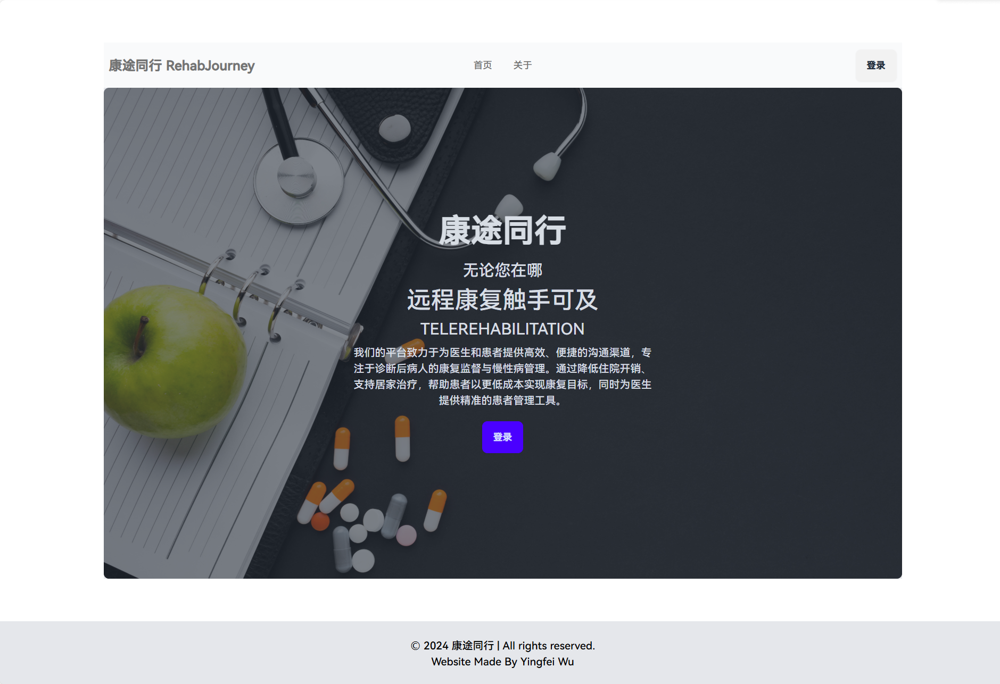

登录界面：

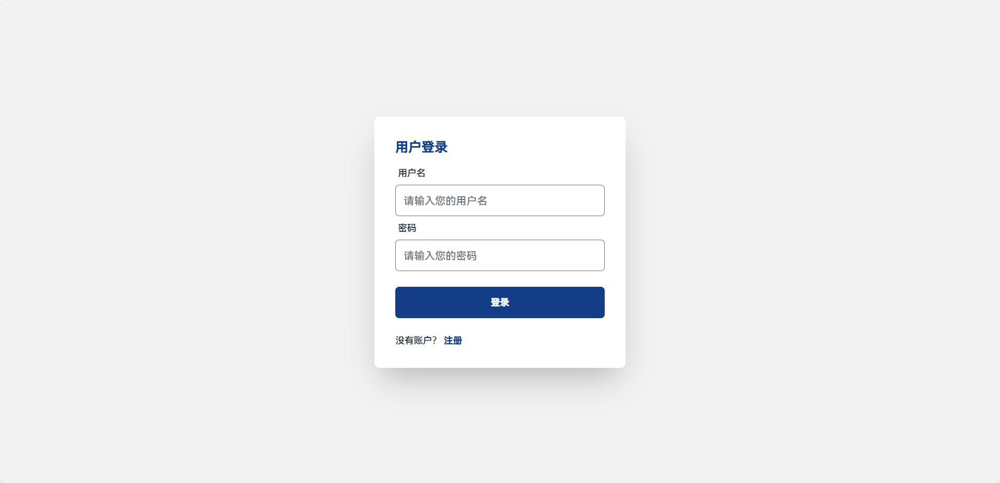

注册界面：

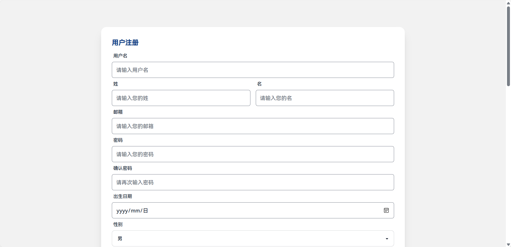

身份选择：

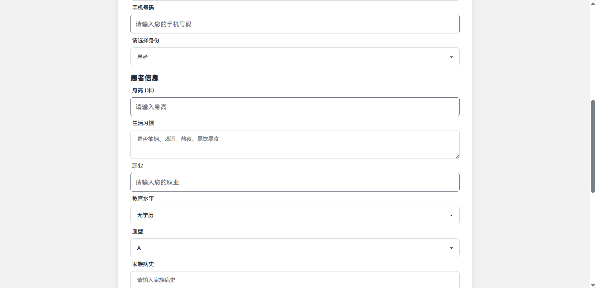

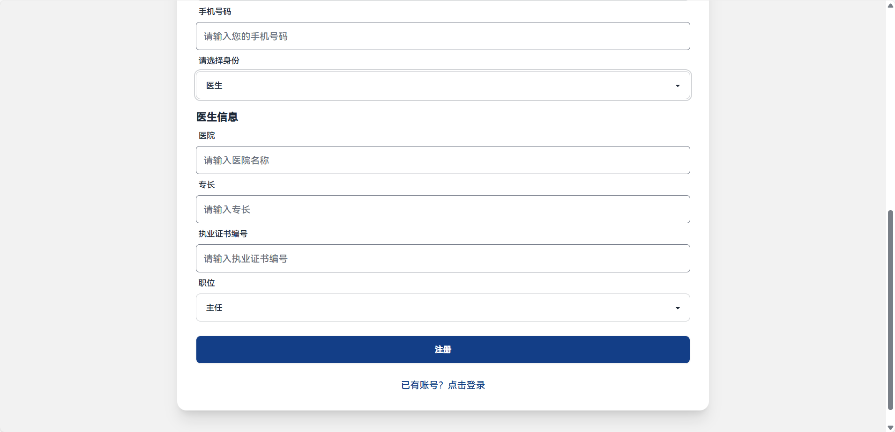

注册成功后跳转登录界面。

#### 患者界面

患者界面的首页：

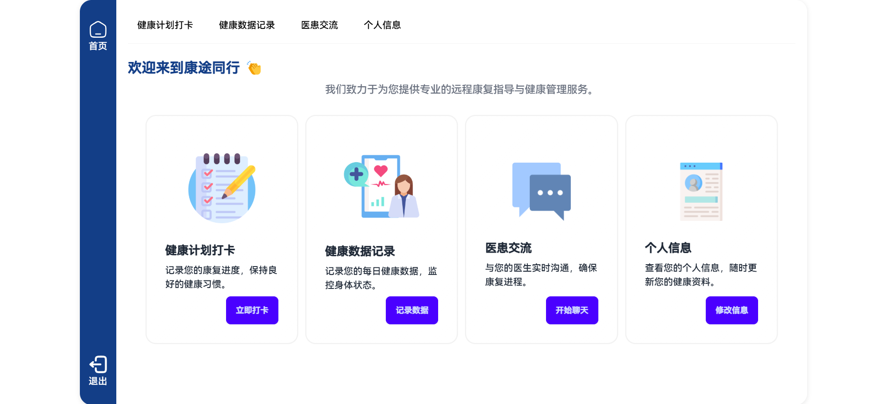

健康计划打卡界面：

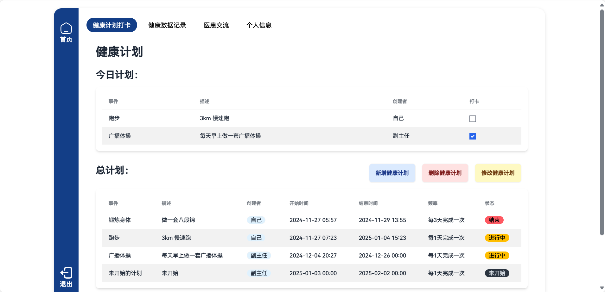

新增健康计划：


删除健康计划：

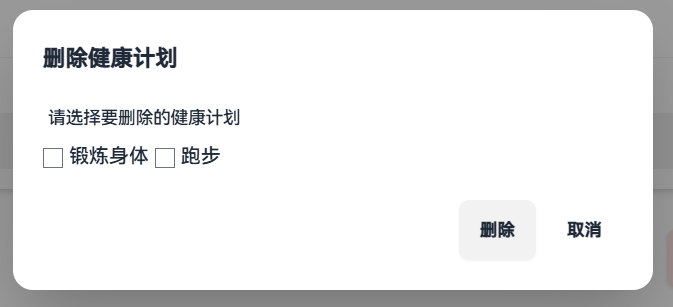

修改健康计划：

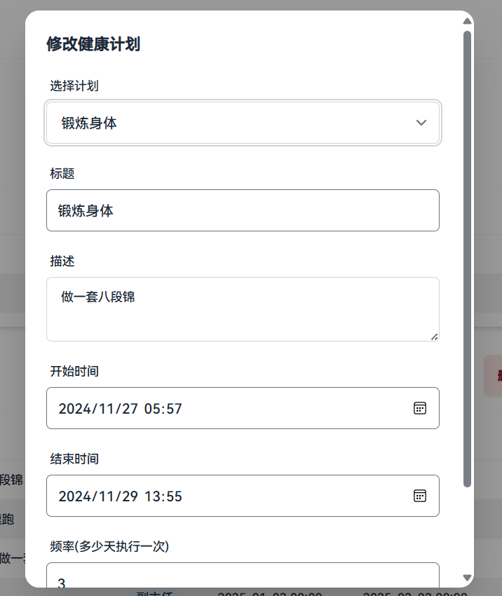

健康数据记录界面：

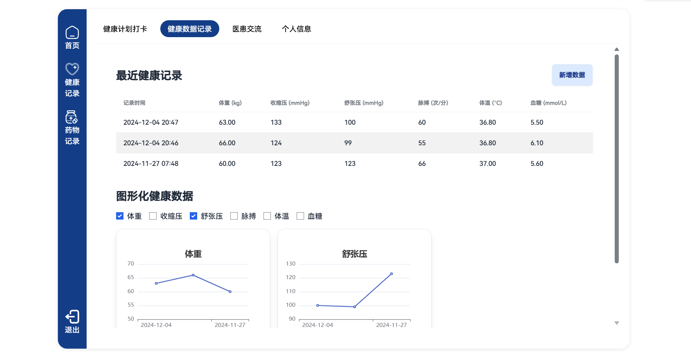

药物摄入数据记录：

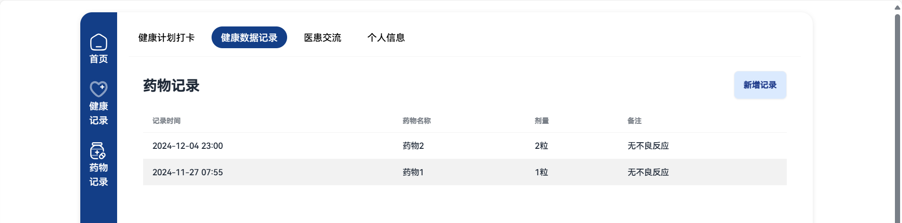

医患交流：

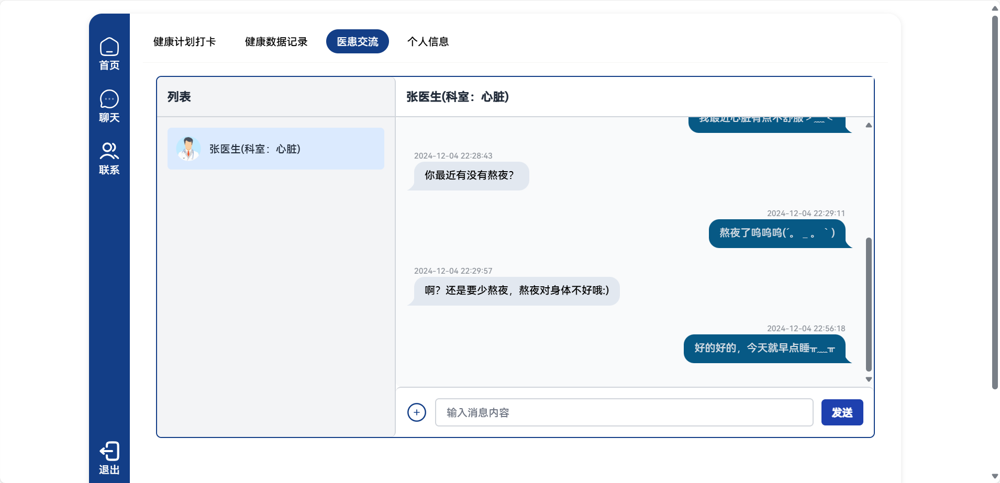

个人信息展示：

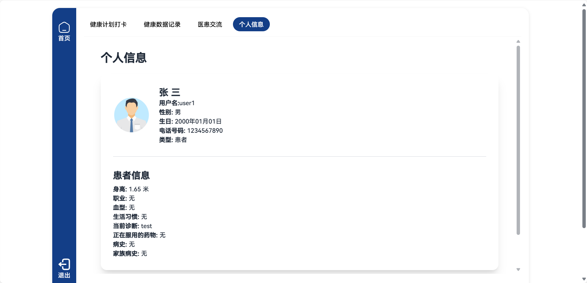

修改个人信息：

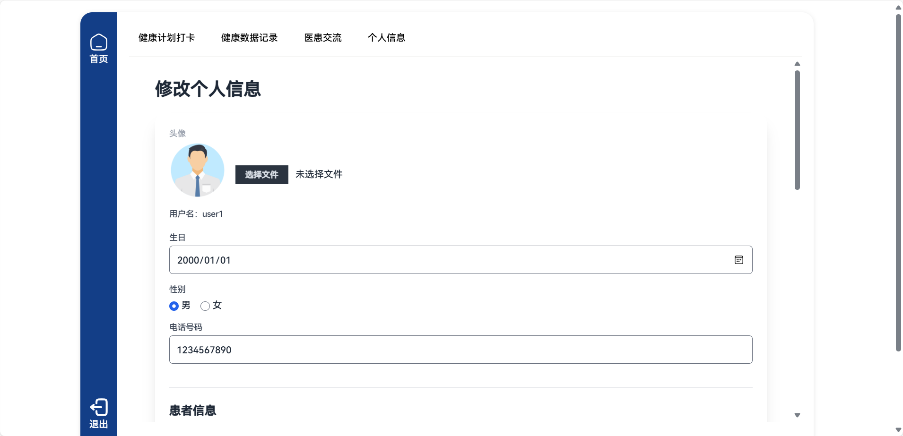

#### 医生界面

患者管理界面：

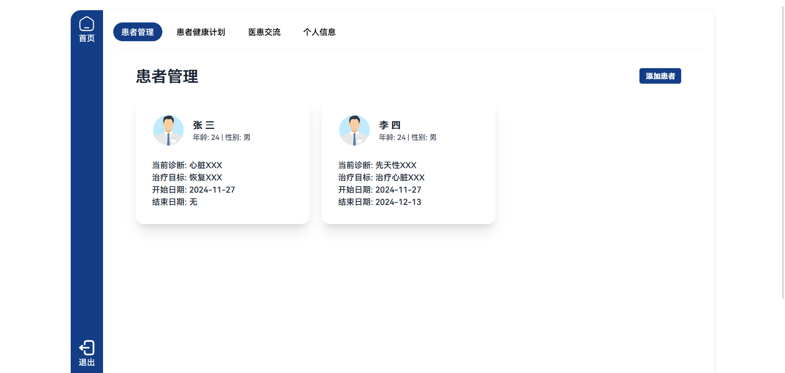

点击患者的卡片，展示患者的基本信息：

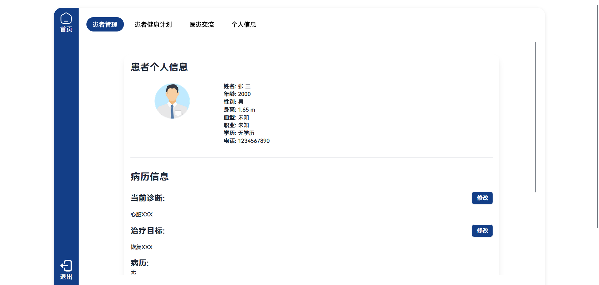

查看患者健康计划：

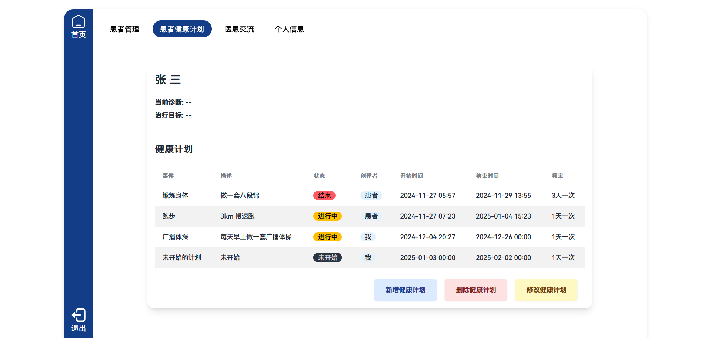

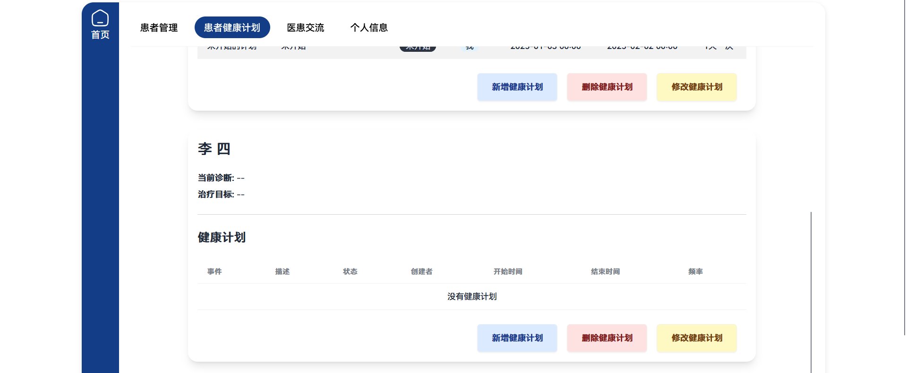

医患交流：


个人信息展示逻辑和患者模块基本一致。

#### 管理员界面

使用 django 自带的界面，在 `admin.py` 中优化数据的展示，得到下面的界面：

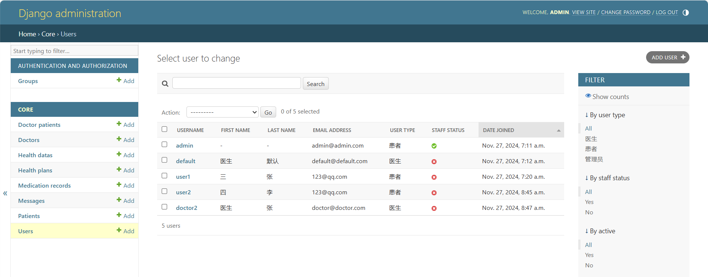
