# 康途同行网站开发文档

## 需求建模

### 系统功能性需求

#### 网站背景及目标

随着老龄化社会的到来，慢性疾病和术后康复患者的数量持续增加，传统的康复模式面临地域、资源和时间成本的限制。远程康复平台能够突破这些障碍，为患者提供高效、便利的康复服务。

**“康途同行-RehabJourney”网站目标**：

1. 为患者提供便捷、专业的远程康复服务，降低就医障碍。
2. 为医生提供工具和数据支持，实现个性化的康复计划制定和动态调整。
3. 打破地域限制，让偏远地区患者享受到优质医疗资源。
4. 通过健康数据记录和在线监测，增强患者康复依从性，提高疗效。


#### 市场与竞品分析

目前，市场上针对慢性病及其他疾病远程康复平台较少，尤其是国内，大部分平台都是提供在线问诊服务，没有考虑康复治疗计划的规律性，还没有特别成熟的针对各种疾病的通用型远程康复平台。

国外的比较成熟的远程康复平台是BlueJay，美国的医疗SaaS平台，虽然其核心功能是远程医疗与信息交流、依从性管理等，但也支持治疗方案预测、治疗组、居家康复等功能，是一个整合性的平台。

本产品在国内前景比较广阔，而且现在很多老年人和子女分开住，使用远程康复系统，能实时为监测老年人的健康状态，同时为老年人指定康复计划或者健康计划，相比于住院康复，能大大降低子女的经济负担。

本产品主要作为医院的扩充性质的服务应用，在医院外建立医患沟通、远程康复监督平台，减少患者康复成本，使得患者随时能够与医生交流。


#### 网站角色及功能

1. **医生**
    远程康复的核心专业资源，医生的主要功能包括：

      * 患者管理：查看分配的患者列表及其康复数据。
      * 健康计划制定：为患者定制个性化康复计划，包括日常锻炼、饮食建议及用药计划。
      * 数据监控：实时查看患者上传的健康数据，分析康复进展。
      * 在线沟通：通过消息与患者沟通，回答问题或调整计划。
      * 病历管理：记录和维护患者病历信息。
      * 个人信息管理：查看和修改个人基本信息。

2. **患者**
    主要服务对象，患者的功能包括：

      * 个人健康档案：查看并管理自身健康信息，包括病历、康复计划及用药记录。
      * 健康数据上传：记录和上传体重、心率、血压、体温、血糖等指标。
      * 康复计划跟踪：接收医生制定的康复计划，查看任务进度并进行打卡。
      * 在线咨询：通过聊天功能向医生提问。
      * 个人信息管理：查看和修改个人的基本信息。

3. **管理员**
    平台维护和管理者，功能就是维护数据库系统。


#### 系统特点

1. **便捷的在线服务**：通过消息、健康数据监控等功能实现医患高效互动。
2. **个性化健康管理**：医生根据患者实际情况，针对性地设定康复计划。

管理员、医生和患者这三种用户的功能需求各不相同，其用户组织架构图如图1所示：


### 系统用例图

系统有三种用户：管理员、医生、患者，他们的功能性需求各不相同，根据系统功能性需求可以绘制出系统用例图，如下图所示：


### 系统核心用例

本系统涉及到的用例比较多，本节主要介绍以下三个核心用例，它们分别是：管理健康数据，增加健康计划，医患交流。

####  管理健康数据

**用例**：管理健康数据
**范围**：远程康复平台
**级别**：用户目标
**主要参与者**：患者
**涉众及其关注点：**

1. **患者**：希望能够方便地记录和查看自己的健康数据，获得数据的趋势分析。
2. **医生**：希望能通过患者上传的健康数据进行远程监控，及时调整治疗方案。

**前置条件**：患者必须已经注册并登录系统，且健康数据录入功能已启用。
**成功保证**：健康数据记录成功，并能在患者个人页面中实时查看、分析数据。
**主成功场景**：

1. 患者用帐号和密码成功登录平台。
2. 患者选择添加健康数据功能。
3. 患者根据医生建议或自我监测，输入或上传健康数据（如体重、血糖、血压等）。
4. 系统验证数据的有效性，并将数据记录到患者个人健康档案中。
5. 患者可以查看健康数据的趋势图，并根据医生的反馈调整健康管理计划。

**扩展：**
 1a. **患者输入的数据格式不正确**： 系统提示数据格式错误，要求患者重新输入正确的格式。

**特殊需求**：系统需支持健康数据的可视化展示，包括趋势图等功能，确保数据清晰易懂。
**发生频率**：常发生。


#### 增加健康计划

**用例**：增加健康计划
**范围**：远程康复平台
**级别**：用户目标
**主要参与者**：患者、医生
**涉众及其关注点**：

1.	患者：希望能根据自己的健康需求设置个性化的康复计划。
2.	医生：希望能为患者创建并调整专业的康复计划，实时监控患者的康复进展。

**前置条件**：患者和医生必须建立医患关系，且患者已登录系统。
**成功保证**：健康计划成功创建并保存，患者可根据计划执行任务。
**主成功场景**：

1.	患者或医生用帐号和密码成功登录平台。
2.	如果是医生，医生在医患关系确认后选择对应患者创建健康计划。
3.	患者也可创建健康计划，但创建者字段为“自己”。
4.	用户填写健康计划的标题、描述、开始时间、频率等详细信息。
5.	用户提交健康计划，系统保存并生成健康计划档案。
6.	医生和患者均可在个人页面查看健康计划，调整相关内容。

**扩展**：
1a. 患者和医生未建立医患关系： 医生无法查看和创建健康计划。
2a. 输入的健康计划数据不完整：系统提示用户填写完整健康计划信息。

**特殊需求**：系统需确保健康计划内容的完整性，且能支持医生根据患者反馈动态调整计划。
**发生频率**：常发生。


#### 医患交流

**用例**：医患交流
**范围**：远程康复平台
**级别**：用户目标
**主要参与者**：患者、医生
**涉众及其关注点**：

1.	患者：希望能与医生进行便捷的线上沟通，获得及时的康复建议。
2.	医生：希望能够高效地与患者沟通，指导患者康复过程，并提供反馈。

**前置条件**：患者和医生必须已成功注册并建立医患关系。
**成功保证**：医患双方可以实时发送和接收文本和文件信息，交流顺畅。
**主成功场景**：

1.	患者或医生用帐号和密码成功登录平台。
2.	患者和医生在平台上通过消息功能进行交流。
3.	用户可以选择发送文本消息或文件信息，确保沟通方式多样化。
4.	医生可以查看患者发送的健康数据或照片等，给予反馈。
5.	患者可以根据医生的建议调整康复计划。

**扩展**：
1a. 患者输入的消息不符合平台规则： 系统提示消息输入格式错误，要求患者重新输入。
2a. 患者发送的文件格式不符合要求：系统提示文件格式错误，并要求患者上传支持格式的文件。

**特殊需求**：系统必须确保消息的即时性和安全性，支持多种文件格式（如图片、PDF、文档等）。
**发生频率**：常发生。


## 架构设计

### 系统架构及原理

我使用 python WEB 框架Django 完成康途同行网站的搭建。

在 Django Web 开发项目中，设计模式主要体现在如何构建清晰、可扩展、易维护的系统结构。Django 基于 MVC（Model-View-Controller） 模式，但实际上它采用的是 MTV（Model-Template-View） 设计模式。以下是对 Django 项目设计模式及其各个层次的详细解释：

1. Model（模型）
   * 作用：在 Django 中，模型（Model）用于定义应用程序的数据结构。它映射到数据库中的表，并封装了数据库交互的逻辑。模型是系统的核心，负责数据存储和数据库操作。
   * 具体工作：
     * 定义数据表结构：通过 Django 的 `models.Model` 类定义类，类的每个属性对应数据库表的字段。
     * 数据验证：模型可以定义字段的验证规则，如长度、类型等。
     * 关系：模型可以通过外键（`ForeignKey`）、一对一（`OneToOne`）和多对多（`ManyToMany`）定义不同模型之间的关系。
     * 与数据库交互：Django ORM（对象关系映射）允许开发者使用 Python 代码而非 SQL 来与数据库进行交互。

2. Template（模板）
   * 作用：模板（Template）负责展示数据，它是 Django 中的视图层。模板层负责生成 HTML，通常通过模板引擎来渲染。
   * 具体工作：
     * 渲染数据：模板可以嵌入动态数据，将传递给模板的数据（如数据库查询结果）插入到页面中。
     * 逻辑：模板支持一些基本的控制结构（如条件判断、循环等），但不涉及复杂的业务逻辑。其目的是展示数据，而非处理数据。
     * 模板继承：Django 提供了强大的模板继承功能，使得页面布局（如 header、footer）可以复用，减少冗余代码。

3. View（视图）
   * 作用：在 Django 中，视图（View）负责业务逻辑的处理，接收用户请求、查询数据库、处理数据，并返回响应（通常是模板）。视图相当于控制器，决定将哪些数据提供给模板。
   * 具体工作：
     * 处理请求：视图函数接收 HTTP 请求，可能会从数据库中获取数据（通过模型），执行一些业务逻辑，并最终返回一个响应（通常是渲染后的 HTML 页面）。
     * URL 路由：视图通常通过 Django 的 URL 路由机制（URLconf）来映射特定的 URL 请求到相应的视图函数或类。
     * 状态管理：视图可以处理用户会话、认证、授权等，确保用户的请求被正确处理。

4. Controller（控制器） - 通过 URL 路由进行映射
   * Django 的 URL 路由机制实际上起到了控制器（Controller）的作用。在 Django 中，视图是与请求映射的，而 URL 配置则负责将用户请求路由到相应的视图函数。
   * 作用：控制请求如何传递到相应的视图，确保每个请求都能被正确的视图处理。
   * 具体工作：
     * URLconf：在 `urls.py` 中定义 URL 模式和视图的映射关系，用户请求特定 URL 时，Django 会调用相应的视图函数。

5. Form（表单）
   * 作用：Django 的表单（Form）是用于处理用户输入数据的工具。它在模型和视图之间起到了桥梁作用，用来验证用户提交的数据并进行相应的处理（如保存到数据库或返回错误信息）。
   * 具体工作：
     * 表单验证：Django 提供了内置的表单类来处理表单数据的验证，如字段验证、清洗数据等。
     * 表单渲染：表单可以渲染成 HTML，供用户输入数据。
     * 表单处理：处理用户提交的数据，检查是否符合要求，并保存或返回错误信息。

6. Admin（后台管理）
   * 作用：Django 提供了一个强大的后台管理界面，使得开发者可以快速管理应用的数据。通过简单的配置，Django 可以自动生成 CRUD 界面来进行数据操作。
   * 具体工作：
     * 管理界面：自动生成表单，允许管理员通过浏览器界面管理数据。
     * 数据展示：Django 的后台管理提供了丰富的功能来展示和操作模型数据。

Django 的设计模式围绕 MTV（Model-Template-View） 构建，主要职责如下：

* Model：负责数据存储和业务逻辑。
* Template：负责数据显示和界面渲染。
* View：处理请求和响应逻辑，执行必要的业务操作。

而 URL 路由作为控制器（Controller）的一部分，将请求分发到相应的视图，进一步处理请求并返回响应。Django 的设计模式注重分离关注点，确保各个层次职责清晰、互不耦合，使得开发者能够高效地构建和维护 Web 应用。

下面是康途同行网站的系统架构：


### 系统数据库设计

#### 概念设计

识别出 用户、医生、患者、健康计划、健康数据、药物记录、信息 这7个实体。每个实体的属性、码如下：

* 用户 `AccountBase`：用户编号 id，用户名username，密码 password，姓 last_name，名 first_name，出生日期 birth_date，性别 gender，电话号码phone_number，用户类型 user_type。
* 医生 `Doctor`：用户编号 user_id，医院 hospital，专业领域 specialization，医师执照编号 license_number，职位 position。
* 患者 `Patient`：用户编号user_id，身高height，血型blood_type，病历 medical_history，当前诊断 current_diagnosis，用药记录 medications，家族病史family_history，过敏信息 allergy_info，生活习惯living_habits，职业occupation，教育水平educational_level。
* 健康计划 `HealthPlan`：计划编号 id，患者用户编号user_id，计划名称title，计划描述description，创建者created_by，开始时间start_time，结束时间due_time，频率frequency，计划状态 status。
* 健康数据 `HealthData`：患者用户编号user_id，记录时间record_time，体重weight，心率heart_rate，收缩压systolic_bp，舒张压diastolic_bp，体温body_temperature，血糖blood_sugar，补充额外数据 extra_data。
* 药物记录 `MedicationRecord`：患者用户编号user_id，药物名称drug，摄入量dosage，记录时间record_time，补充内容notes。
* 消息 `Message`：消息编号 id，发送者编号sender_id, 接收者编号receiver_id, 消息类型message_type, 文本内容text_content, 文件地址file_url, 发送时间send_time。

根据实际语义，分析实体之间的联系，确定实体之间一对一，一对多和多对多联系:

1.	用户与医生的关系
   * 每个用户（AccountBase）都可以是医生（Doctor）或患者（Patient）。用户表中的每一条记录都可以通过外键映射到医生表和患者表。
   * 医生通过其在医生表中的 user_id 与 用户表 中的 id 关联。一个医生对应一个用户，但一个用户可能既是患者也可能是医生。
2.	医生与患者的关系
   * 一个医生可以治疗多个患者，而一个患者通常有一名或多名医生进行管理。
   * 这通过 医生患者关系表（DoctorPatient） 来实现，该表包含每一名患者与其主治医生的对应关系。
3.	健康计划与患者的关系
   * 每个健康计划（HealthPlan）是由医生为患者量身定制的，基于医生和患者之间的关系。每个健康计划都与患者对应。
   * 患者可以有多个健康计划，但每个健康计划只对应一个患者。
4.	健康数据与患者的关系
   * 每个健康数据（HealthData）记录都对应一个特定的患者，并记录该患者的健康状态。患者可以有多个健康数据记录。
   * 健康数据与患者之间通过 patient_id 进行关联。
5.	药物记录与患者的关系
   * 药物记录（MedicationRecord）表示患者的用药历史，多个药物记录可以关联到一个患者。
   * 药物记录通过 patient_id 与患者表关联。
6.	消息与医生、患者的关系
   * 医患之间的消息（Message）能够记录沟通历史，且可以是文本或文件。每条消息都由一个发送者（患者或医生）发送给接收者（患者或医生）。
   * 消息通过 sender_id 和 receiver_id 与用户表中的用户关联，允许医患之间的多对多消息传递。

根据上面的内容设计 E-R 图：

.png)

#### 逻辑设计

数据库模式由用户表（AccountBase），医生表（Doctor），患者表（Patient），药物记录表（MedicationRecord），健康数据表（HealthData），医生患者关系表（DoctorPatient），健康计划表（HealthPlan），消息表（Message）8 个基本表组成：

* AccountBase(<u>id</u>, email, password, first_name, last_name, birth_date, gender, phone_number, user_type)
* Doctor(<u>user_id</u>, hospital, specialization, license_number, position)
* Patient(<u>user_id</u>, height, family_history, current_diagnosis, medical_history, medications, allergy_info, living_habits, occupation, educational_level)
* DoctorPatient(<u>id</u>, doctor_id, patient_id, therapeutic_goal, start_date, end_date)
* HealthPlan(<u>id</u>, dr_pt_id, title, description, start_time, due_time, frequency, status)
* HealthData(<u>id</u>, patient_id, record_time, heart_rate, weight, systolic_bp, diastolic_bp, body_temperature, blood_sugar, extra_data)
* MedicationRecord(<u>id</u>, patient_id, drug, dosage, record_time, notes)
* Message(<u>id</u>, sender_id, receiver_id, message_type, text_content, file_url, send_time)

建立的远程康复数据库模式如下图所示：


#### 数据库表设计
**数据库表汇总**

| 表名                 | 说明                             |
|----------------------|----------------------------------|
| `AccountBase` | 存放基础用户信息 |
| `Doctor`       | 存放医生信息                     |
| `Patient`            | 存放患者信息                     |
| `DoctorPatient`     | 存放医生和患者的关系             |
| `HealthPlan`        | 存放健康计划                     |
| `HealthData`        | 存放患者健康数据                 |
| `MedicationRecord`  | 存放患者药物摄入记录             |
| `Message`            | 存放消息记录                     |

**详细信息**

**AccountBase（基础用户表）**

| 字段名         | 数据类型         | 主键、外键 | 允许空 | 说明                         |
| -------------- | ---------------- | ---------- | ------ | ---------------------------- |
| `id`           | `integer`        | 主键       | 否     | 用户编号                     |
| `username`     | `string`         | 唯一键     | 否     | 用户名                       |
| `email`        | `string`         | 唯一键     | 否     | 用户邮箱                     |
| `password`     | `string`         |            | 否     | 用户密码                     |
| `birthday`     | `date`           |            | 是     | 用户生日                     |
| `phone_number` | `string`         |            | 是     | 用户联系电话                 |
| `gender`       | `boolean`        |            | 否     | 性别（True：男，False：女）  |
| `avatar`       | `ProcessedImage` |            | 否     | 用户头像                     |
| `user_type`    | `string`         |            | 否     | 用户类型（医生/患者/管理员） |


**Doctor（医生表）**

| 字段名           | 数据类型      | 主键、外键    | 允许空  | 说明                   |
|-------------------|---------------|---------------|---------|------------------------|
| `user_id`         | `integer`     | 外键(AccountBase) | 否      | 用户编号               |
| `hospital`        | `string`      |               | 否      | 医院                   |
| `specialization`  | `string`      |               | 否      | 专业领域               |
| `license_number`  | `string`      | 唯一键         | 否      | 医师执照编号           |
| `position`        | `string`      |               | 否      | 职位                   |

**Patient（患者表）**

| 字段名           | 数据类型       | 主键、外键    | 允许空  | 说明                   |
|-------------------|----------------|---------------|---------|------------------------|
| `user_id`         | `integer`      | 外键(AccountBase) | 否      | 用户编号               |
| `height`          | `decimal`      |               | 是      | 身高（单位：米）       |
| `blood_type`      | `string`       |               | 否      | 血型                   |
| `medical_history` | `text`         |               | 是      | 病史                   |
| `family_history`  | `text`         |               | 是      | 家族病史               |
| `current_diagnosis`| `text`        |               | 是      | 当前诊断               |
| `medications`     | `text`         |               | 是      | 用药情况               |
| `allergy_info`    | `text`         |               | 是      | 过敏信息               |
| `living_habits`   | `text`         |               | 是      | 生活习惯               |
| `occupation`      | `string`       |               | 是      | 职业                   |
| `educational_level`| `string`      |               | 否      | 教育水平               |

**DoctorPatient（医生-患者关系表）**

| 字段名           | 数据类型       | 主键、外键  | 允许空  | 说明                   |
|-------------------|----------------|-------------|---------|------------------------|
| `id`             | `integer`      | 主键        | 否      | 关系编号               |
| `doctor_id`      | `integer`      | 外键(Doctor)| 否      | 医生编号               |
| `patient_id`     | `integer`      | 外键(Patient)| 否     | 患者编号               |
| `start_date`     | `date`         |             | 否      | 治疗开始日期           |
| `end_date`       | `date`         |             | 是      | 治疗结束日期           |
| `therapeutic_goal`| `text`        |             | 是      | 治疗目标               |

**HealthPlan（健康计划表）**

| 字段名           | 数据类型       | 主键、外键  | 允许空  | 说明                   |
|-------------------|----------------|-------------|---------|------------------------|
| `id`             | `integer`      | 主键        | 否      | 健康计划编号           |
| `doctor_patient_id`| `integer`    | 外键(DoctorPatient)| 是 | 关联的医生-患者关系编号 |
| `title`          | `string`       |             | 否      | 健康计划名称           |
| `description`    | `text`         |             | 是      | 健康计划描述           |
| `created_by`     | `string`       |             | 否      | 创建者                 |
| `start_time`     | `datetime`     |             | 否      | 创建时间               |
| `due_time`       | `datetime`     |             | 是      | 结束时间               |
| `frequency`      | `integer`      |             | 否      | 频率                   |
| `status`         | `string`       |             | 否      | 健康计划状态           |


**HealthData（健康数据表）**

| 字段名           | 数据类型       | 主键、外键  | 允许空  | 说明                   |
|-------------------|----------------|-------------|---------|------------------------|
| `id`             | `integer`      | 主键        | 否      | 数据编号               |
| `patient_id`     | `integer`      | 外键(Patient)| 否     | 患者编号               |
| `record_time`    | `datetime`     |             | 否      | 数据记录时间           |
| `weight`         | `decimal`      |             | 是      | 体重                   |
| `heart_rate`     | `integer`      |             | 是      | 心率                   |
| `systolic_bp`    | `integer`      |             | 是      | 收缩压                 |
| `diastolic_bp`   | `integer`      |             | 是      | 舒张压                 |
| `body_temperature`| `decimal`     |             | 否      | 体温                   |
| `blood_sugar`    | `decimal`      |             | 否      | 血糖                   |
| `extra_data`     | `text`         |             | 是      | 补充数据               |

**MedicationRecord（用药记录表）**

| 字段名           | 数据类型       | 主键、外键  | 允许空  | 说明                   |
|-------------------|----------------|-------------|---------|------------------------|
| `id`             | `integer`      | 主键        | 否      | 记录编号               |
| `patient_id`     | `integer`      | 外键(Patient)| 否     | 患者编号               |
| `drug`           | `string`       |             | 否      | 药物名称               |
| `dosage`         | `string`       |             | 否      | 剂量                   |
| `record_time`    | `datetime`     |             | 否      | 记录时间               |
| `notes`          | `text`         |             | 是      | 备注                   |

**Message（消息表）**

| 字段名           | 数据类型       | 主键、外键  | 允许空  | 说明                   |
|-------------------|----------------|-------------|---------|------------------------|
| `id`             | `integer`      | 主键        | 否      | 消息编号               |
| `sender_id`      | `integer`      | 外键(AccountBase)| 否  | 发送者编号             |
| `receiver_id`    | `integer`      | 外键(AccountBase)| 否  | 接收者编号             |
| `message_type`   | `string`       |             | 否      | 消息类型（文本/文件）  |
| `text_content`   | `text`         |             | 是      | 文本内容               |
| `file_url`       | `URLField`     |             | 是      | 文件链接               |
| `status`         | `string`       |             | 否      | 消息状态（已发送/已读）|
| `send_time`      | `datetime`     |             | 否      | 消息发送时间           |


## 模块设计

django 项目是由项目目录、应用目录、静态文件、模板、迁移文件、用户上传文件组成。其中，项目目录包含整个 django 项目的全局配置。django 项目可以包含多个应用（app），每个应用对应单独功能模块或业务逻辑单元，包含模型项目、视图、URL路由和管理配置等。静态文件是存储网站的静态资源，如 css、js 文件。迁移文件由 `migrations` 目录管理，用户上传文件由 `media` 目录管理。

康途同行网站共分为 医生、患者、管理员三个模块，医生和患者分别创建为单独的应用 doctor 和 patient，管理员使用 django 提供的 admin 模块，并把模型（数据库）访问权限分配给管理员。

在这个网站项目中，页面交互功能基本都是在 `views.py` 中实现，前端使用 JS 和后端交互。

项目的结构： 

```cmd
Project
│
├─.venv
│
├─core  # 核心应用，model.py 定义所有应用使用的模型
│  │  admin.py
│  │  apps.py
│  │  consumers.py
│  │  form.py
│  │  models.py
│  │  routing.py
│  │  urls.py
│  │  views.py
│  │  __init__.py
│  │
│  ├─migrations
│  │
│  └─__pycache__
│
├─doctor  # 医生应用
│  │  apps.py
│  │  urls.py
│  │  views.py
│  │  __init__.py
│  │
│  ├─migrations
│  │
│  └─__pycache__
│
├─media  # 用户上传文件存储地址
│  ├─avatar
│  └─chat_files
│ 
│
├─patient  # 患者应用
│  │  apps.py
│  │  urls.py
│  │  views.py
│  │  __init__.py
│  │
│  ├─migrations
│  │  │  __init__.py
│  │  │
│  │  └─__pycache__
│  │          __init__.cpython-311.pyc
│  │
│  └─__pycache__
│
├─Project  # 全局配置目录
│  │  asgi.py
│  │  settings.py
│  │  urls.py
│  │  wsgi.py
│  │  __init__.py
│  │
│  └─__pycache__
│
├─static  # 静态资源
│
├─manage.py
│
│ # tailwind css 组件的相关配置文件
├─node_modules
├─package.json
├─package-lock.json
├─postcss.config.js
├─tailwind.config.js
│
└─templates  # 模板
    │  core_base.html
    │  doctor_base.html
    │  patient_base.html
    │  patient_chat_base.html
    │
    ├─core
    │      about.html
    │      index.html
    │      login.html
    │      signup.html
    │
    ├─doctor
    │      chat.html
    │      index.html
    │      modify_info.html
    │      patient_health_plan.html
    │      patient_info.html
    │      patient_manage.html
    │      personal_info.html
    │
    └─patient
            chat.html
            contact.html
            health_data.html
            health_plan.html
            index.html
            medication_record.html
            modify_info.html
            personal_info.html
```


### 核心模块

`core` 应用，主要实现了`admin.py`，`form.py` ，`models.py` ，`consumers.py` ，`routing.py` ，`urls.py` ，`views.py` 这些文件：

* `admin.py`：为 管理员 admin 分配数据库管理权限。
* `form.py` ：定义 `views.py` 会使用的表单。
* `models.py` ：定义了整个项目会使用的 8 个模型，对应的就是数据库中的 8 个数据表：用户表（AccountBase），医生表（Doctor），患者表（Patient），药物记录表（MedicationRecord），健康数据表（HealthData），医生患者关系表（DoctorPatient），健康计划表（HealthPlan），消息表（Message）。
* `consumers.py` ：定义了实时聊天时候使用的WebSocket 连接的处理逻辑，处理 WebSocket 的连接、接收消息、发送消息和关闭连接等操作。
* `routing.py`：指定 WebSocket 的 URL 路由规则，将客户端的 WebSocket 请求映射到相应的 consumer，通过 `routing.py` 将不同的 WebSocket 请求指向合适的 consumer 类。
* `urls.py` ：负责定义 core 应用内的 URL 路由规则，将用户的 HTTP 请求映射到相应的视图（view）函数（在 `views.py` 文件中实现）。
* `views.py` ：定义视图函数，这些视图处理用户的请求并返回响应。视图的主要作用是接收请求、执行相应的业务逻辑（如查询数据库、处理表单等），然后返回一个 HTTP 响应对象，通常是一个网页、JSON 数据或重定向。

#### 模型的定义：`models.py` 

基础的用户类 `AccountBase` ：继承了 Django 自带的 `AbstractUser` 模块，使得用户认证更加安全，并且简化网站用户管理的逻辑。

```python
class AccountBase(AbstractUser):
    """
    自定义用户模型，扩展了默认的 Django AbstractUser。

    属性：username, password, first_name, last_name, email, is_staff, is_active, date_joined, objects

    拓展属性：birthday, phone_number, gender, avatar, user_type
    """
    # 基本信息
    birthday = models.DateField(null=True, blank=True)
    phone_number = models.CharField(max_length=15, null=True, blank=True)
    gender = models.BooleanField(
        _("Gender"),
        choices=[(True, "Male"), (False, "Female")],
        default=False,
        help_text=_("Designates whether the user is male or female."),
    )

    # 头像存储的地址
    avatar = ProcessedImageField(upload_to='avatar',
                                 default='avatar/user.png',
                                 verbose_name='头像',
                                 processors=[ResizeToFill(100, 100)])

    # 用户类型，具有预定义的选择项：医生、患者 或 管理员(不出现在注册地方)
    user_type = models.CharField(
        max_length=10,
        choices=[
            ("doctor", "医生"),
            ("patient", "患者"),
            ("admin", "管理员"),
        ],
        default="patient",
    )

    groups = models.ManyToManyField(
        Group,
        related_name="custom_user_set",  # Use a unique related_name
        blank=True,
        help_text=_(
            "The groups this user belongs to. A user will get all permissions "
            "granted to each of their groups."
        ),
        verbose_name=_("groups"),
    )
    user_permissions = models.ManyToManyField(
        Permission,
        related_name="custom_user_set",  # Use a unique related_name
        blank=True,
        help_text=_("Specific permissions for this user."),
        verbose_name=_("user permissions"),
    )

    def __str__(self):
        return self.username or self.email
```

其他模型基本都是继承 `models.Model` 这个 django内置的模型，然后根据数据库设计表的内容设计各个字段。例如 `MedicationRecord` ：

```python
class MedicationRecord(models.Model):
    """
    药物摄入记录

    属性：patient, drug, dosage, record_time, notes
    """
    patient = models.ForeignKey(
        Patient, on_delete=models.CASCADE, related_name="medication_records"
    )
    drug = models.CharField(max_length=100)  # 药物名称
    dosage = models.CharField(max_length=20)  # 摄入量字符串表示
    record_time = models.DateTimeField(auto_now_add=True, )  # 记录时间
    notes = models.TextField(blank=True)  # 补充内容，比如不良反应

    def __str__(self):
        return f"Medication record for {self.patient.user.username} on {self.record_time}"
```


#### 功能的实现：`views.py` 

简单 主页展示 的功能：

```python
def index_view(request):
    return render(request, 'core/index.html')
```


核心应用 实现 登录`login` 、注册 `signup` 、退出 `logout` 这三个核心功能。

登录功能的实现 `login_view`：使用 django 的认证库实现登录功能，并根据用户类型的不同定向到不同的网址。

```python
def login_view(request):
    """
    登录功能函数：处理用户登录请求。
    根据用户输入的用户名和密码进行身份验证，登录成功后将用户信息存入 session，
    并根据用户类型跳转到相应页面。
    """
    from datetime import timedelta  # 导入 timedelta 用于设置会话过期时间

    # 判断请求方法是否为 POST（即表单提交）
    if request.method == 'POST':
        # 获取表单提交的用户名和密码
        username = request.POST.get("username")
        password = request.POST.get("password")

        # 使用 Django 的 authenticate 函数验证用户名和密码是否正确
        user = authenticate(request, username=username, password=password)

        if user is not None:
            # 登录成功
            auth_login(request, user)  # 使用 Django 提供的 auth_login 方法自动管理用户的 session

            # 设置登录成功后的提示消息
            messages.success(request, f"登录成功！欢迎回来，{user.username}")

            # 将用户的相关信息存入 session 以便后续使用
            request.session['is_login'] = True  # 设置用户已登录
            request.session['user_type'] = user.user_type  # 存储用户类型（例如：doctor 或 patient）
            request.session['username'] = user.username  # 存储用户名

            # 设置会话的过期时间，例如设置为 1 天
            request.session.set_expiry(timedelta(days=1).total_seconds())

            # 根据用户的类型进行跳转：
            if user.user_type == 'doctor':
                return redirect('/doctor/')  # 如果是医生，跳转到医生页面
            elif user.user_type == 'patient':
                return redirect('pt_index')  # 如果是患者，跳转到患者首页
            else:
                return redirect('/')  # 如果是其他类型用户，跳转到首页

        else:
            # 登录失败，设置错误信息并返回到登录页面
            error_message = "用户名或密码输入错误，请重试。"  # 提示用户登录失败
            return render(request, "core/login.html", {"error_message": error_message})

    # 如果是 GET 请求，直接返回登录页面
    return render(request, "core/login.html")
```


注册功能的实现`signup_view` ：首先，接收 `POST` 请求，获取并验证用户表单 `UserSignupForm` 的数据，如果验证通过，则创建一个新的用户对象，并加密密码后保存。接着，根据用户选择的类型（医生或患者），会分别展示相应的表单（医生表单 `DoctorProfileForm` 或患者表单 `PatientProfileForm`）。若表单验证通过，医生或患者的额外信息将被保存，并与用户对象关联。对于患者，还会创建一个默认的 `DoctorPatient` 关联记录，指定默认医生。注册成功后，用户将被重定向到登录页面；若表单验证失败，则返回相应的错误消息，并重新渲染注册页面。


退出功能的实现 `logout_view`：使用 django 内置的认证的 `logout` 函数就实现退出功能，退出之后定向到网站的首页。


### 医生模块

在 `doctor` 应用中，只实现 `urls.py` 和 `views.py` 这两个文件。在 `views.py` 中集中实现了医生模块的各种功能。在实现视图之前，自定义了每个视图前必须添加的修饰器，用于认证用户，要求调用视图函数（或者说，访问视图对应的那些页面）的前提是用户登录且用户身份是医生：

```python
# 自定义装饰器：要求用户为医生
def doctor_required(view_func):
    from django.http import HttpResponseForbidden
    @login_required  # 确保用户已登录
    def _wrapped_view(request, *args, **kwargs):
        if request.user.user_type != 'doctor':  # 根据 user_type 判断是否为医生
            return HttpResponseForbidden("You do not have permission to access this page.")
        return view_func(request, *args, **kwargs)
    return _wrapped_view
```

这样可以一定程度上提高网站的安全性。

`views.py` 中定义的视图有：

1. 基础视图：`index_view` ，用于渲染医生端的主页。

2. 患者管理功能：
   1. `patient_manage_view`：该视图用于医生端管理患者的页面。通过渲染 `doctor/patient_manage.html` 模板来展示患者管理界面。使用了 `@doctor_required` 装饰器，确保只有医生用户可以访问该页面。
   2. `fetch_patient_view`：该视图允许医生查看所有与其相关的患者信息。通过 POST 请求，获取当前医生的患者列表，包括患者的个人信息、诊断、治疗目标、起止日期等。返回的数据通过 `JsonResponse` 以 JSON 格式提供给前端。
   3. `add_patient_view`：该视图允许医生为其添加新的患者（即建立医生与患者的关系）。医生提供患者的用户名、治疗目标、开始日期、结束日期等信息。视图验证患者是否存在，并通过 `DoctorPatient.objects.get_or_create()` 创建或更新医生与患者的关系。如果成功，返回一个成功的 JSON 响应。
   4. `check_patient_username_view`：该视图用于检查输入的患者用户名是否有效。通过 POST 请求，接收 JSON 数据，验证用户名是否存在，并且该用户是否为患者类型。还会检查医生是否已经管理该患者。如果验证成功，返回一个 JSON 响应，表示用户名有效。
   5. `patient_info_view`：该视图用于展示某个特定患者的详细信息，包括患者的基本信息、当前诊断、治疗目标、健康数据记录和药物记录。通过患者的 `user_id` 获取相关信息，并将这些数据渲染到 `doctor/patient_info.html` 模板中，供医生查看。
   6. `update_patient_info_view`：该视图允许医生更新患者的当前诊断和治疗目标。医生通过 POST 请求提交新的数据，其中包含患者的 ID、需要更新的字段（如 `current_diagnosis` 或 `therapeutic_goal`），以及新的值。更新完成后，返回一个 JSON 响应，表示更新的结果。
   
3. 查看、增加、修改、删除所负责的患者的健康计划：删改的前提是健康计划是医生自己创建的。为了展示实现逻辑，对下面的四个代码进行解释，其他查看、增加、修改、删除功能的实现和下面四个视图的实现大体相似。
   1. `patient_health_plan_view`：该视图用于展示医生所管理的所有患者的健康计划。它首先获取医生与患者之间的关系，然后根据每个患者的健康计划进行排序，并将所有健康计划按照起始时间排列。最终，所有患者的健康计划被传递给前端模板进行展示。
   
      ```python
      @doctor_required
      def patient_health_plan_view(request):
          """
          展示医生所管理的所有病人的健康计划
          """
          # 获取当前登录医生所管理的所有病人的关系
          doctor_patient_relationships = DoctorPatient.objects.filter(doctor__user=request.user)
      
          # 为每个病人获取所有 doctor_patient 关系下的健康计划，并根据起始时间排序
          patient_health_plans = []  # 用于存储每个病人的所有健康计划
      
          for relationship in doctor_patient_relationships:
              patient = relationship.patient  # 获取当前病人
              dr_pt = DoctorPatient.objects.filter(patient=patient)  # 获取该病人和医生的所有关系
              health_plans = []  # 当前病人的所有健康计划
      
              for dp in dr_pt:
                  # 获取当前 doctor_patient 关系下的所有健康计划，并按起始时间排序
                  plans = HealthPlan.objects.filter(doctor_patient=dp).order_by('start_time')
      
                  for plan in plans:
                      # 如果当前健康计划对应的医生是请求中的医生，并且创建者不是 "我"，则将创建者修改为 "我"
                      if dp.doctor.user == request.user and plan.created_by != "我":
                          plan.created_by = "我"  # 仅在视图中修改，不保存到数据库
      
                      health_plans.append(plan)  # 添加健康计划
      
              # 将当前病人的健康计划与病人信息一起存储
              patient_health_plans.append({
                  "patient": relationship.patient.user,  # 病人的用户信息
                  "health_plans": health_plans  # 病人的健康计划列表
              })
      
          # 渲染页面，将病人的健康计划数据传递给模板
          return render(request, "doctor/patient_health_plan.html", {"patient_health_plans": patient_health_plans})
      ```
   
      
   
   2. `add_patient_health_plan_view`：该视图允许医生为选定患者添加健康计划。医生通过填写健康计划的标题、描述、开始时间、截止时间和频率等信息，创建新的健康计划并与医生患者关系关联。创建成功后，页面重定向到健康计划页面。
   
      ```python
      @doctor_required
      def add_patient_health_plan_view(request, user_id):
          """
          为选定患者添加健康计划
          :param request: 前端请求对象
          :param user_id: 选定患者的 user_id，表示患者的唯一标识
          """
          from django.utils import timezone
      
          # 获取指定患者对象，如果找不到则返回 404 错误
          patient = get_object_or_404(Patient, user_id=user_id)
      
          # 获取当前登录医生对象，如果找不到则返回 404 错误
          doctor = get_object_or_404(Doctor, user=request.user)
      
          # 查找与当前医生和患者相关联的 DoctorPatient 实例，确保医生与患者的关系存在
          doctor_patient = DoctorPatient.objects.filter(patient=patient, doctor=doctor).first()
      
          # 如果请求方法是 POST，表示提交了表单数据
          if request.method == 'POST':
              # 获取表单中提交的健康计划信息
              title = request.POST.get('title')  # 健康计划标题
              description = request.POST.get('description', '')  # 健康计划描述，默认为空字符串
              start_time = request.POST.get('start_time')  # 健康计划开始时间
              due_time = request.POST.get('due_time')  # 健康计划结束时间
              frequency = request.POST.get('frequency')  # 健康计划频率
      
              # 如果有结束时间 due_time，将其转换为日期时间格式
              if due_time:
                  due_time = timezone.datetime.fromisoformat(due_time)
      
              # 创建新的健康计划实例
              health_plan = HealthPlan(
                  doctor_patient=doctor_patient,  # 关联的医生患者关系
                  title=title,  # 健康计划的标题
                  description=description,  # 健康计划的描述
                  due_time=due_time,  # 健康计划的结束时间
                  created_by=request.user,  # 创建者为当前医生（即请求的用户）
                  start_time=start_time,  # 健康计划的开始时间
                  frequency=frequency,  # 健康计划的频率
                  status='uncompleted',  # 健康计划的状态，默认为 "未完成"
              )
      
              # 保存健康计划到数据库
              health_plan.save()
      
              # 创建健康计划后，重定向到患者健康计划页面
              return redirect('dr_patient_health_plan')
      ```
   
      
   
   3. `delete_health_plans_view`：该视图允许医生删除自己创建的健康计划。医生通过 POST 请求提供健康计划的 ID 列表，系统根据这些 ID 删除相关的健康计划，并返回删除成功的消息。
   
      通过 template 前端使用 `` 判断，把是该医生创建的计划展示在对话弹窗中，保证医生只能删除他自己创建的健康计划。在后端再加入判断逻辑，防止前端修改input 的value值导致误删其他人创建的健康计划。
   
      ```python
      @doctor_required
      def delete_health_plans_view(request):
          """
          删除自己添加的计划
          """
          if request.method == 'POST':
              # 获取选择的健康计划 ID 列表
              selected_plans = request.POST.getlist('plans[]')  # 获取传递的所有计划 ID
      
              if not selected_plans:
                  return JsonResponse({'status': 'error', 'message': '没有选中的计划'})
      
              # 获取与当前医生相关的健康计划
              health_plans_to_delete = HealthPlan.objects.filter(id__in=selected_plans)
      
              # 检查健康计划的创建者是否为该医生
              for plan in health_plans_to_delete:
                  if plan.doctor_patient is None or plan.doctor_patient.doctor.user != request.user:
                      return JsonResponse({'status': 'error', 'message': f'健康计划 {plan.title} 不是由您创建，无法删除'})
      
              # 执行删除操作
              health_plans_to_delete.delete()
              return JsonResponse({'status': 'success', 'message': '删除成功'})
          return JsonResponse({'status': 'error'})
      ```
   
      
   
   4. `edit_health_plan_view`：该视图允许医生编辑自己创建的健康计划。医生通过 POST 请求提供需要修改的健康计划 ID 和修改后的各项内容（如标题、描述、开始时间、截止时间、频率等），系统会更新健康计划并返回修改成功的消息。如果计划不存在或请求无效，将返回错误信息。
   
      ```python
      @doctor_required
      def edit_health_plan_view(request):
          """
          修改自己创建的计划
          """
          if request.method == "POST":
              plan_id = request.POST.get("plan_id")  # 获取要修改的健康计划 ID
              title = request.POST.get("edit_title")
              description = request.POST.get("edit_description")
              start_time = request.POST.get("edit_start_time")
              due_time = request.POST.get("edit_due_time")
              frequency = request.POST.get("edit_frequency")
      
              # 打印 debug 信息，确保 plan_id 正确
              print(f"Received plan_id: {plan_id}")
      
              try:
                  # 获取对应的健康计划并更新
                  plan = HealthPlan.objects.get(id=plan_id, doctor_patient__doctor__user=request.user)
                  plan.title = title
                  plan.description = description
                  plan.start_time = start_time
                  plan.due_time = due_time
                  plan.frequency = frequency
                  plan.save()
      
                  return JsonResponse({"status": "success", "message": "健康计划修改成功"})
              except HealthPlan.DoesNotExist:
                  return JsonResponse({"status": "error", "message": "健康计划不存在"})
      
          return JsonResponse({"status": "error", "message": "无效的请求"})
      ```
   
      
   
4. 医患交流：
   1. `chat_view`：该视图用于展示医生与其所有患者的聊天列表。通过查询 `DoctorPatient` 模型，获取当前登录医生管理的患者，并排除医生与自己聊天的情况。然后将患者列表传递给前端模板以便渲染。
   2. `get_messages_view`：该视图用于获取医生与某个患者的聊天记录。首先验证聊天对象的合法性（即确保医生和患者之间存在关系）。然后获取两者之间的所有消息，并根据消息的类型（文本或文件）构建响应数据，返回聊天记录的详细信息。
   3. `send_message_view`：该视图允许医生发送文本消息。通过 POST 请求接收消息的接收者 ID 和消息内容，校验数据有效性后，保存消息到数据库并返回成功响应。如果请求无效或缺少数据，则返回错误信息。
   4. `send_file_view`：该视图允许医生发送文件消息。通过 POST 请求上传文件，验证接收者和文件的有效性，生成唯一文件名并存储文件。保存文件后，创建相应的消息记录并返回文件的 URL、文件名和大小信息。如果发生错误，则返回错误响应。
   
5. 个人信息管理：
   1. `personal_info_view`：该视图用于展示当前医生的个人信息。它从请求中获取当前登录用户的信息，并将其传递给前端模板，以便显示在个人信息页面中。
   2. `modify_info_view`：该视图用于更新医生或患者的个人信息。根据请求方法，如果是 `POST`，它会接收并更新用户的基本信息（如生日、性别、手机号、头像等）。如果用户是患者或医生，还会更新相关的患者或医生详细信息（如身高、家族史、医院等）。更新完成后，视图将重定向到个人信息页面。


### 患者模块

在 `patient` 应用中只实现了 `urls.py` 和 `views.py` 。`views.py` 中实现了患者模块的各种功能。在实现视图之前，自定义了每个视图前必须添加的修饰器，用于认证用户，要求调用视图函数（或者说，访问视图对应的那些页面）的前提是用户登录且用户身份是患者，实现方法和医生模块的修饰器的实现差不多。

基础视图、医患交流、个人信息模块的视图和医生模块的差不多。健康计划管理、健康数据记录和药物记录视图：

1. 健康计划管理：
   1. `health_plan_view`：该视图用于展示当前患者的所有健康计划。它会自动判断健康计划的状态，如果计划已过期则标记为 `expired`。此外，根据当前时间和计划的起止时间及频率，自动筛选出今天需要执行的健康计划，并将所有计划和今天的计划传递给前端显示。
   2. `add_health_plan_view`：该视图用于允许患者添加新的健康计划。用户通过 POST 请求提交健康计划的标题、描述、起始时间、截止时间和频率等信息，系统会查找默认医生与当前患者的关系，并将其作为健康计划的关联医生患者关系保存。添加成功后，用户会被重定向到健康计划页面。
   3. `delete_health_plans_view`：该视图允许患者删除自己创建的健康计划。通过 POST 请求传递选中的健康计划 ID 列表，系统会删除这些计划并返回相应的成功或失败信息。如果没有选中任何计划，则返回错误提示。
   4. `edit_health_plan_view`：该视图允许患者修改自己创建的健康计划。通过 POST 请求提交修改后的健康计划信息，系统会查找对应的健康计划并更新其标题、描述、起始时间、截止时间和频率等字段。如果修改成功，返回成功信息；如果健康计划不存在，则返回错误信息。
   5. `update_plan_status_view` ：该视图对患者今日打卡的计划进行状态更新。
2. 健康数据记录和药物记录视图：
   1. `health_data_view`：该视图用于显示当前患者的健康数据记录，包括体重、血压、心率等各项指标。通过查询最新的健康记录并将其按日期倒序排序，生成适用于图表的格式化数据，并将这些数据传递给前端，以便显示健康数据的折线图。
   2. `add_health_data_view`：该视图用于患者添加新的健康数据记录。患者通过 POST 请求提交健康数据，包括体重、血压、心率、体温和血糖等。系统会对数据进行验证、转换，并保存新的健康记录。如果请求为 AJAX 请求，则返回成功信息；否则重定向回健康数据页面。
   3. `medication_record_view`：该视图用于显示当前患者的药物记录。通过查询患者的药物记录并按时间倒序排列，显示最近的记录。患者可以查看自己历史的药物使用记录。
   4. `add_medication_record_view`：该视图允许患者添加新的药物记录。通过 POST 请求提交药物名称、剂量、记录时间及备注等信息。系统会对数据进行验证，确保药物名称和剂量是必填项，并保存新的药物记录。如果请求为 AJAX 请求，返回成功信息；否则重定向回药物记录页面。


## 部署与应用

### 部署

开发环境：python 3.11，下载网站：https://www.python.org/downloads/release/python-3119/


开发平台：pycharm  2024.3，下载网站：https://www.jetbrains.com/pycharm/download/?section=windows

首先使用 pycharm 打开项目


此时还没有配置 django 环境，所以需要先配置一下。

首先创建虚拟环境：

首先，点击 Pycharm 左下角的编译器部分，然后选择添加新的编译器

 


在命令行输入：

```shell
pip install django
pip install -r requirements.txt
```

、

requirements 包括：

```
channels==4.2.0
channels_redis==4.2.1
Django==5.1.3
django-appconf==1.0.6
django-imagekit==5.0.0
mysqlclient==2.2.6
pillow==11.0.0
pipreqs==0.5.0
redis==5.2.0
uvicorn==0.32.1
websockets==14.1
```

正式运行前，还需要配置 mysql 数据库

MYSQL下载地址：https://dev.mysql.com/downloads/installer/

完成 MYSQL 的基本注册后，在MYSQL在中创建一个表格，存放应用数据。然后在项目 Project 目录的 `settings.py` 文件中修改 `DATABASES` 的配置：

 

* `NAME`：数据库名称
* `HOST`：本地运行直接写：`127.0.0.1` 
* `USER`：数据库用户的名称
* `PASSWORD`：数据库密码
* `PORT`：mysql 默认 3306


配置好之后，还需要使用 `manage.py` 构建数据库的表格，在命令行输入

```
python manage.py makemigrations core
python manage.py migrate core
python manage.py makemigrations
python manage.py migrate
```

可以使用 pycharm 提供的 django 项目启动按钮启动网站程序：


或者在根目录打开 powershell 输入：在项目根目录打开 powershell 输入：

```shell
Set-ExecutionPolicy -ExecutionPolicy RemoteSigned -Scope Process
.venv\Scripts\activate
```

激活项目目录下面的 `.venv` 中的虚拟环境。

然后输入：

```shell
python manage.py runserver
```

再在浏览器打开  http://127.0.0.1:8000 就可以看到网站首页，根据网站指引可以完成登录和注册功能，然后进入用户界面。

【注】程序设定是有一个默认医生，所以在进行普通用户注册等事务前，需要先要注册一个名字为 `default` 的医生，避免程序出错。因为本项目的目的是作为医院的一种扩充性质服务，用于远程康复监督，所以医患关系的建立由医生确定，医生可以通过患者用户名，确定所要监督的患者。

要实现实时通信，就需要安装 Redis server5.0.14.1，安装包已经放入项目总文件中，安装完成后，打开新的 powershell 窗口输入：

```shell
uvicorn Project.asgi:application --host 127.0.0.1 --port 8001
```

然后可以实现用户实时通信。


### 部分功能截图

#### 基础界面

网站首页：


登录界面：

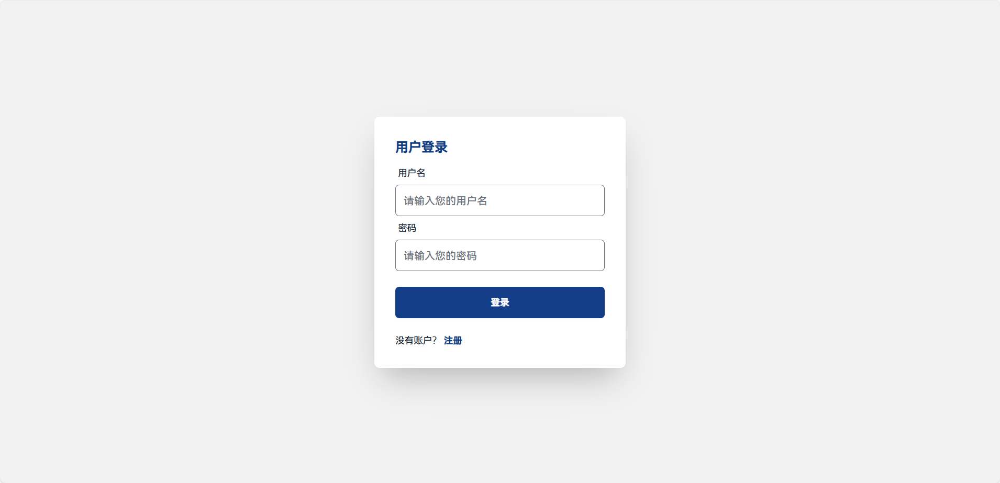

注册界面：


身份选择：


注册成功后跳转登录界面。

#### 患者界面

患者界面的首页：


健康计划打卡界面：


新增健康计划：

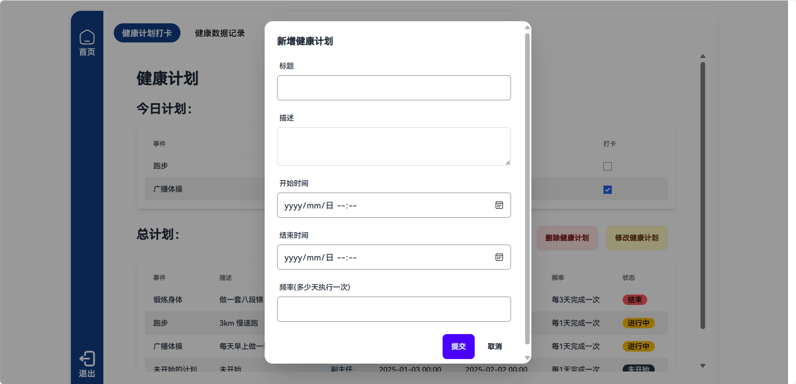

删除健康计划：

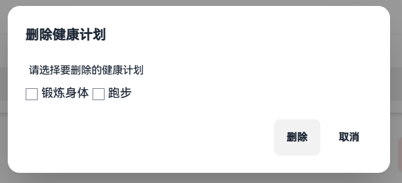

修改健康计划：


健康数据记录界面：

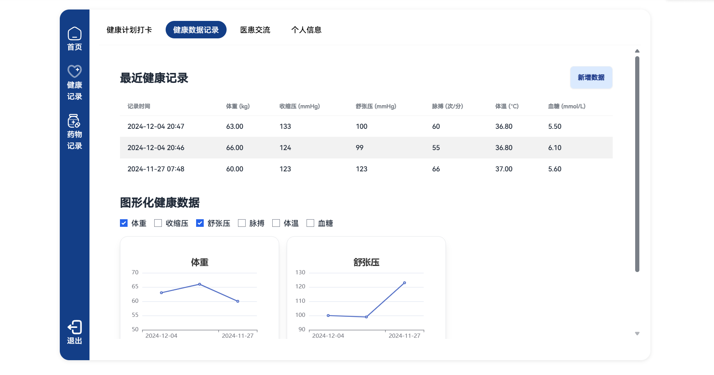

药物摄入数据记录：


医患交流：

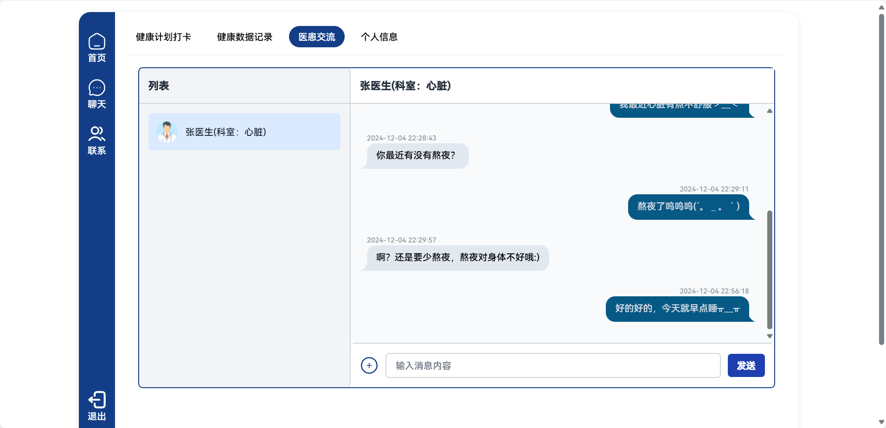

个人信息展示：

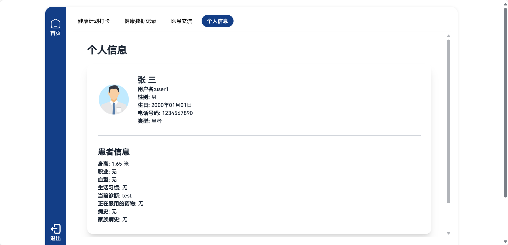

修改个人信息：


#### 医生界面

患者管理界面：

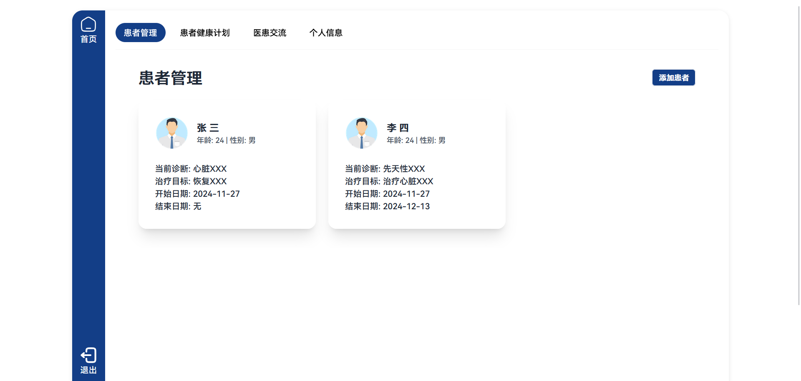

点击患者的卡片，展示患者的基本信息：

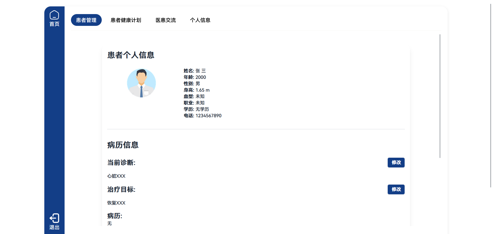

查看患者健康计划：

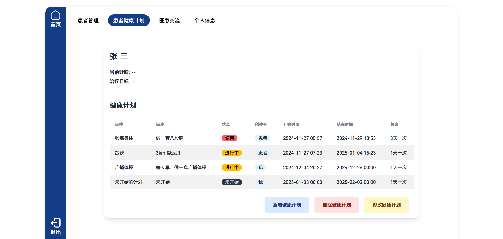


医患交流：

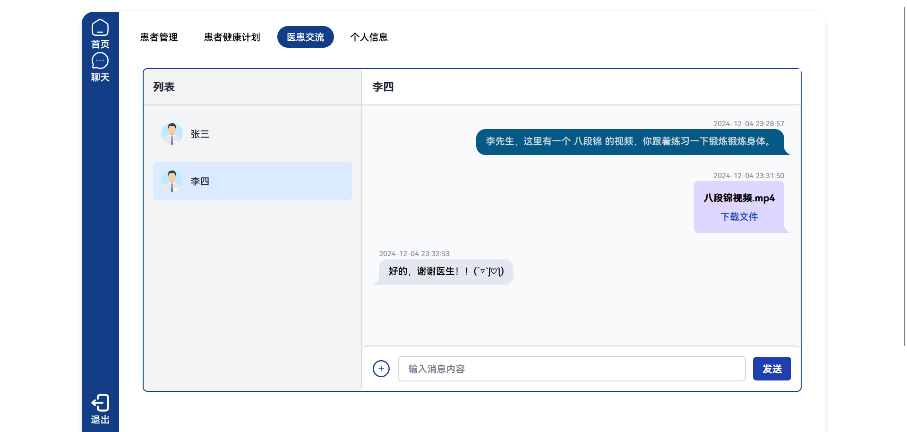

个人信息展示逻辑和患者模块基本一致。

#### 管理员界面

使用 django 自带的界面，在 `admin.py` 中优化数据的展示，得到下面的界面：

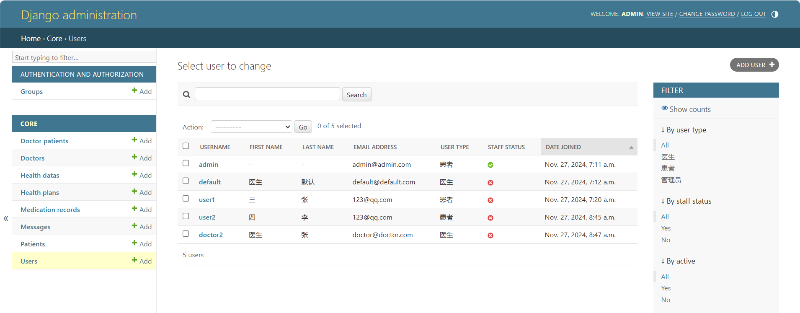
